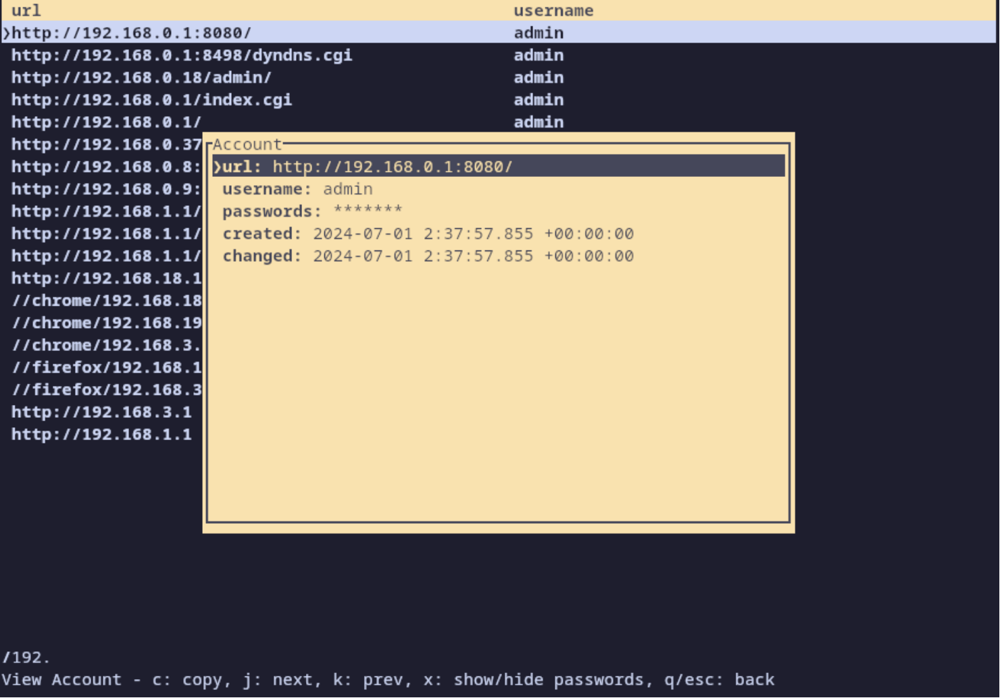

# TecPass: Tec Password Manager

`TecPass` protects passwords with [Argon2](https://en.wikipedia.org/wiki/Argon2) and [AES](https://en.wikipedia.org/wiki/Advanced_Encryption_Standard), and stores them with [SQLite](https://www.sqlite.org) in local directory `~/.config/tecpass` by default.

`TecPass` is currently in beta. Some features are still being worked on, such as copy/paste being available only on wayland of linux system.

## Features

- [x] Basic CRUD management
- [ ] Filter
    - [x] Fitler by a key word
    - [ ] Filter by fuzzy matching
- [ ] Login
    - [x] Require a password to log in.
    - [x] Register a new password for initialization
    - [ ] Change a existing password
    - [ ] Reset a new password in case of forgetting
- [ ] Copy and Paste
    - [x] wayland
    - [ ] x11
    - [ ] macOS
- [ ] Import existing accounts
    - [x] Firefox
    - [x] [pass](https://www.passwordstore.org/)
    - [ ] Chrome


## Install

Use [cargo-install](https://doc.rust-lang.org/cargo/commands/cargo-install.html) to install the executable `tecpass` into the installation root’s bin folder.

```shell
git clone https://github.com/tecposter/tecpass.git
cd tecpass
cargo install --path .
```

If rust is installed by `asdf`, run the following command to recreate shims

```shell
asdf reshim rust
```

## Usage

Initialize a password and login to manager accounts.

```shell
tecpass
```

### Import Firefox accounts

Open page `about:logins`, click the right top button `...`, select the menu item `Export Passwords`, and then select a path to save all the firefox passwords in a csv file.

After getting the csv file path, run the following command to import the firefox accounts
```shell
tecpass --import-firefox ./data/firefox-passwords.csv
```

### Import pass accounts

Goto the `tecpass` project folder to run the script `./script/export-pass.sh` to export `pass` accounts to the file `exported_passes`. `pass` will need passphrase to unlock the OpenPGP secret key.

```shell
./script/export-pass.sh
```

Then run the following command to import the `pass` accounts

```shell
tecpass --import-pass ./data/exported_passes
```

